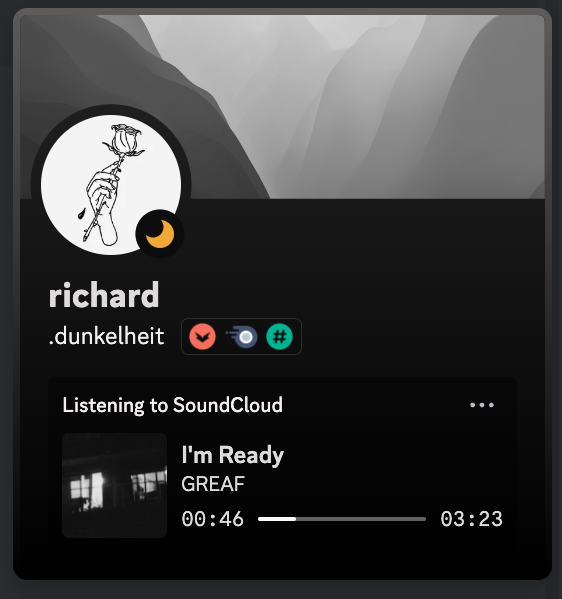

# soundcloud-rpc - a SoundCloud Client with Discord Rich Presence, Dark Mode, Last.fm and AdBlock support

## About This Fork

This fork modifies the original application by removing the default Electron frame (header, scrollbar) to create a more
consistent and seamless design experience. The application features a cleaner interface while maintaining all the
functionality of the original.

### Key Modifications:

-   Frameless window design for a modern look and feel
-   Custom window controls integrated with SoundCloud's interface
-   Enhanced UI consistency across the application
-   Smoother scrolling experience with custom scrollbar styling

**Note:** This repository only builds and distributes the Windows version of the application.

## Preview

 

## Installation

### Release

For the latest version of soundcloud-rpc, download the installer or executable file from the
[latest release](https://github.com/Lunatica-Luna/soundcloud-rpc/releases) page.

**Windows Only:** This fork only provides builds for Windows platforms. For other platforms, please refer to the
original repository or build from source.

> [!NOTE]
>
> ### macOS Users
>
> If you encounter a "Damaged App" popup after installation, run the following command in the terminal to resolve the
> issue:
>
> ```
> xattr -dr com.apple.quarantine /Applications/soundcloud.app
> ```
>
> After running this command, the app should launch without any problem.

### Manual

Before installing and running this app, you must have [Node.js](https://nodejs.org/) installed on your machine.

1. Clone this repository to your local machine
2. Run `npm install` to install the required dependencies.
3. Run `npm start` to launch the application.

## Configuration

-   The application settings are stored locally using Electron's `electron-store` module.
-   Adblocker settings can be toggled using keybinds.
-   Last.fm automatic track scrobbling can be enabled through keybinds and registering your API keys.

## Keybinds

| Keybinding              | Description                                          |
| ----------------------- | ---------------------------------------------------- |
| F2                      | Toggles adblocker                                    |
| F3                      | Shows the proxy config window                        |
| F4                      | Insert last.fm api keys for scrobbling functionality |
| Ctrl + B or Command + B | Goes back to the previous web page                   |
| Ctrl + F or Command + F | Goes forward a web page                              |

## Credits

-   Originally created by [Richard Habitzreuter](https://github.com/richardhbtz)
-   The Discord Rich Presence integration is implemented using the
    [discord-rpc](https://www.npmjs.com/package/discord-rpc) package.
-   The Electron window is created using the [Electron](https://www.electronjs.org/) framework.
-   The executable is packed using [electron-builder](https://www.electron.build/).

## Contributing

Contributions to this project are welcome. If you find a bug or would like to suggest a new feature, please open an
issue on this repository.

## License

This project is licensed under the MIT License. See the [LICENSE](./LICENSE) file for details.
